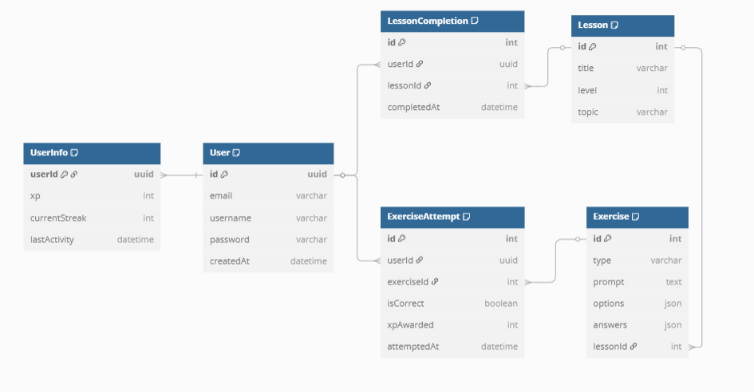

# 📚 Language Learning Platform API Documentation

A RESTful backend built with **Node.js** and **Prisma**, designed for a Duolingo-style Sanskrit learning experience. Users can learn lessons, attempt exercises, and track their progress via XP, streaks, and leaderboards.

---

## 🔐 Authentication

* Sessions are handled using **cookies and tokens**
* All `/auth/*` routes are **protected** and require valid login

---

## 📊 Full API Documentation

[Click here to view the full Postman API docs](https://documenter.getpostman.com/view/45931833/2sB2x8FX4K)


## 📌 Public Endpoints

| Method | Path           | Description                          |
| ------ | -------------- | ------------------------------------ |
| POST   | `/signup`      | Register a new user                  |
| POST   | `/login`       | Log in an existing user              |
| GET    | `/leaderboard` | Get the current XP-based leaderboard |

---

## 🔒 Protected Endpoints (`/auth/*` – Requires Authentication)

| Method | Path                   | Description                             |
| ------ | ---------------------- | --------------------------------------- |
| GET    | `/auth/viewlessons`    | View all lessons with completion data   |
| POST   | `/auth/attempt`        | Attempt an exercise (updates XP/streak) |
| GET    | `/auth/userdetails`    | Get user info, progress, and stats      |
| POST   | `/auth/createexercise` | Create a new exercise                   |
| POST   | `/auth/createlesson`   | Create a new lesson                     |
| PUT    | `/auth/editexercise`   | Edit an existing exercise               |
| PUT    | `/auth/editlesson`     | Edit an existing lesson                 |

---

### 🧠 Behind the Scenes

* `updateActivityMiddleware`: Automatically updates user’s `lastActivity` timestamp
* `authMiddleware`: Validates session token or cookie for protected routes

---
## 📊 Database Schema




----
 ### TO Setup
To set up this project locally:

1. **Clone the repository**  
    ```bash
    git clone <repo-url>
    cd LinguaSage
    ```

2. **Install dependencies**  
    ```bash
    npm install
    ```

3. **Configure environment variables**  
    Create a `.env` file in the root directory with:
    ```
    PORT=<port on which you want to run the server>
    JWTKEY=<your jwt key>
    DB_URL=<your database connection url>
    ```

4. **Run database migrations**  
    ```bash
    npx prisma migrate deploy
    ```

5. **Start the server**  
    ```bash
    npm start
    ```

---

**Alternatively, use the prebuilt Docker image:**

```bash
docker pull povtemp/lingua
docker run -d \
  -e PORT=<port> \
  -e JWTKEY=<your jwt key> \
  -e DB_URL=<your db connection url> \
  -p <host-port>:<port> \
  povtemp/lingua
```

Replace the environment variables as needed.

---

**Or, use Docker Compose for a one-step setup:**

A `docker-compose.yml` file is included in the project. It handles everything for you.

1. Edit the `.env` file with your configuration as above.
2. Start all services with:
    ```bash
    docker-compose up -d
    ```

This will automatically build and run the app with the required environment variables.
